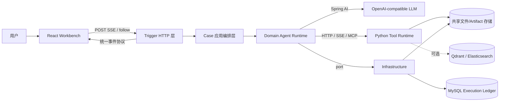
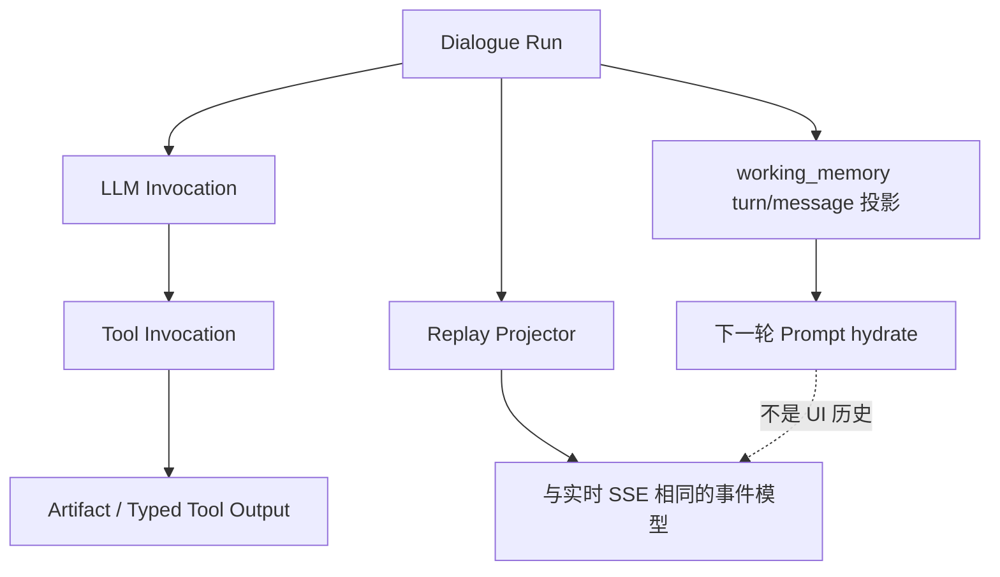

# Reactor 两天面试冲刺手册

> 目标：不是背功能清单，而是能清楚解释「为什么这么分层、一次请求如何流转、断线/取消/HITL 如何保证正确性、哪些地方仍可改进」。

## 1. 90 秒项目介绍

Reactor 是一个面向研究、数据分析和内容交付的多智能体工作台。它把系统拆成三个适合各自问题域的运行时：

- React 工作台负责对话、任务面板、文件/GenUI 预览，并消费 SSE 实时事件；
- Java/Spring Boot 是控制平面：鉴权、会话、Agent 生命周期、ReAct / Plan-Solve 编排、HITL、执行账本和回放；
- Python/FastAPI 是执行平面：搜索、RAG、NL2SQL、代码与文档工具、文件服务和沙箱代理。

核心设计不是「调用大模型」，而是把一个可能长时间运行、可并发、可暂停、可恢复的 Agent Run 做成可审计的状态机。MySQL 的 Execution Ledger 保存执行事实；前端实时 SSE 与历史回放共用事件投影协议；working memory 仅用于下一轮 Prompt 的上下文恢复，不能充当用户可见历史。

## 2. 架构全景

### 分层和职责

| 模块 | 职责 | 面试中该强调什么 |
| --- | --- | --- |
| `ui` | React 19、SSE 连接、事件归并、计划/任务/产物可视化 | UI 不是只渲染文本；它维护 run 游标、断线 follow 和后台会话状态。 |
| `Reactor-agent-trigger` | Controller、cookie/visitor filter、SSE adapter | 把 HTTP/SSE 协议隔离在边缘，Controller 不写业务流程。 |
| `Reactor-agent-case` | 请求准入、策略分发、停止/注入/follow/HITL resume | 应用层编排用例，不让 domain 依赖 Web 协议。 |
| `Reactor-agent-domain` | Agent、工具、端口、记忆、账本模型、回放投影 | 最重要的业务规则和状态机所在地。 |
| `Reactor-agent-infrastructure` | MyBatis DAO、HTTP gateway、memory provider、工具服务适配 | 实现 domain port，替换基础设施不应影响 Agent 规则。 |
| `Reactor-agent-app` | Spring Boot 启动与 Bean 装配、线程池、配置 | composition root；装配回流到 app，而不是污染 domain。 |
| `reactor-tool` | FastAPI 工具运行时与文件服务 | 将重计算和 Python 生态从 JVM 编排进程剥离。 |

根 Maven 项目用六个 Java 模块表达上述边界；入口是 `Reactor-agent-app/src/main/java/org/wwz/ai/Application.java`。

## 3. 一次对话请求怎样跑完

以“帮我研究某行业并输出报告”为例：

1. `ui/src/utils/querySSE.ts` 向 `/web/api/v1/gpt/queryAgentStreamIncr` 发起 **POST SSE**。它默认不自动重发原请求，避免断线后重复创建任务。
2. `AiAgentController` 立即建立长连接、注册 heartbeat，把请求交给 `GptQueryApplicationService`。
3. 应用服务规范化请求、生成 `AgentRequest`，确认 visitor 对 session 有所有权；如果会话已有未答问题或未审批计划，拒绝新 run，防止上下文出现未闭合工具调用。
4. 它创建 `AgentResponseProjectionStream`，再放入有界 `dispatchExecutor`。并发饱和会返回结构化拒绝结果，而不是把线程耗尽。
5. `AgentDispatchService` 只选择策略：普通任务走 ReAct，深度任务走 Plan-Solve。策略负责领域执行，projection stream 才负责把领域事件变成 SSE JSON。
6. Strategy 创建 `AgentContext`、初始化 Execution Ledger、组织工具集与 Prompt。Agent 每轮执行 `think -> tool calls -> observe`，LLM 和每个 tool call 都会记入账本。
7. 工具需要 Python 时通过 port/gateway 调 `reactor-tool`；文件同时写成 artifact 引用，保证实时展示和之后的回放不依赖临时 URL。
8. 后端将计划、thought、tool_call、tool_result、文件、最终总结等逐帧投影给 UI。前端以 `messageId/taskId/taskOrder` 归并到任务时间线。
9. 主 Agent 结束时，若后台子任务还在运行，不能关 SSE；后台完成后发送 `stream_settle` 再收尾。断线客户端可拿 `requestId + lastEventSeq` 调 `/api/agent/run/follow`，而不重跑任务。

**一句话总结链路：** `HTTP/SSE 接入 → session 准入 → 有界调度 → 策略选择 → Agent 循环/工具 → Ledger 记录 → 统一事件投影 → 实时 UI 与历史回放`。

## 4. 两种 Agent 模式

### ReAct：单个主 Agent 的闭环

- `BaseAgent.run` 在第一轮注入 session 环境；后续轮次优先装载 `workingMemoryMessages`，只追加当前用户输入，以保持 Prompt 前缀稳定并提高模型缓存命中。
- 每一步检查取消信号、吸收用户的运行中注入（inject）、记录执行位置和上下文水位，然后 `think()` 决定是否 `act()`。
- 工具结果回写到上下文，也以结构化事件推给前端。

适合范围明确、工具链不复杂或无需强制拆解的任务。

### Plan-Solve：主 Agent 编排 + 子 Agent 执行

- Plan-Solve 的主 Agent 可见工具被刻意收窄为计划、任务、消息、HITL、工作区与记忆等“编排能力”。
- 真正的搜索、数据分析、代码执行等重工具留给子 Agent；`AgentDispatchTool` 通过 `SubAgentRunner` 和并发闸门运行它们。
- 这样主 Agent 不会既做管理又被大量工具细节淹没；同时能让多个子任务并行，并在父 run 完成后继续留住 SSE 直到后台任务 settle。

适合深度研究、跨来源收集、分析/写作阶段清晰的长任务。

## 5. 最值得讲清楚的状态与持久化设计

### 三类数据不要混淆

1. **Execution Ledger（事实源）**：session、run、LLM 调用、工具调用、artifact 和专用工具输出。用于审计、历史列表、历史详情和回放。
2. **Working memory（上下文投影）**：每轮可重新 hydrate 的 Message，给下一轮模型上下文、压缩和 session search 使用。它为了性能/上下文窗口而存在，不保证完整的用户展示语义。
3. **Long-term memory（策展记忆）**：用户偏好、稳定事实、可复用流程。它有 provider 抽象，默认可关闭；一次性任务进度不应被写进去。

### 为什么回放不是直接读聊天记录？

工具调用和产物是运行事实，不只是“文本消息”。`ReplayProjector` 会按 LLM/tool 的真实顺序把 ledger 转回同样的事件结构；因此刷新后能恢复计划卡片、深度搜索阶段、代码产物、GenUI 与 HITL 卡片，而不是只能看到一段最终 Markdown。

### 取消、断线、暂停如何处理

- **stop**：控制面将 request 标为取消，Agent 在 step 边界检查并以 `STOPPED` 结束账本。
- **inject**：用户中途补充要求只入队，下一 step 再 drain 进 memory；不新开 run、不创建第二条 SSE。
- **断线**：浏览器不重发原 POST；保存 event sequence 后通过 follow 订阅同一 run。
- **AskUser / Plan Approval**：run 进入 `WAITING_INPUT`，回答/审批后 CAS claim 再创建 continuation run，避免重复 resume。

这部分是面试官最可能追问“可靠性设计”的地方。

## 6. Python Tool Runtime 为什么独立

`reactor-tool/server.py` 以 FastAPI 暴露工具和文件 API，并按角色拆成 API（1601）和 sandbox（1602）进程：sandbox 单 worker，防止多 worker 各自持有不一致的本地执行状态。Java 只知道 Remote HTTP/SSE/File ports，不直接耦合 Python 框架。

Python 侧主要能力：

- DeepSearch：查询拆解、搜索、抓取、分章总结和报告；
- MRAG：文档解析、OCR、文本/图像检索、rerank 和回答；
- NL2SQL / Data Analysis：表结构召回、SQL 执行与图表数据；
- Code Interpreter：沙箱代理、脚本执行和文件采集；
- docread / docgen：PDF、Word、Excel、HTML、PPT 等处理；
- file_manage：上传、预览、下载与 artifact 文件索引。

## 7. 前端的关键设计

- Vite 对 `/web` 代理 Java、对 `/tool` 代理 Python；所以开发时 `ui/.env` 必须提供 `SERVICE_BASE_URL=http://127.0.0.1:8100` 和 `REACTOR_TOOL_BASE_URL=http://127.0.0.1:1601`。
- `sseParsers.ts` 只校验事件“骨架”和主键，允许未知字段透传。这降低了前后端富结构结果演进时的耦合。
- `useConversationStream` 给高频 thought、workspace task 做 32/48ms 节流，避免流式更新把 React 渲染压垮。
- 切换会话时不会错误 abort 后台 run；刷新后也会根据 ledger 中 RUNNING 的 run 走 follow，而不是重发用户问题。

## 8. 面试中可以主动说的风险与改进

这些是基于本地构建/启动验证和代码得出的观察，不是泛泛而谈。

1. **前端首屏包较大**：构建输出的主 JS 约 6.5MB（gzip 约 1.8MB）。可为图表、Mermaid、PDF、代码高亮和 3D 工作区做路由/组件级 lazy import、Rollup manual chunks，并设置性能预算。
2. **Lottie 依赖有 `eval` 警告**：构建通过，但生产安全扫描/严格 CSP 需要评估该依赖，或隔离/替换渲染器。
3. **启动页依赖后端 bootstrap**：后端不可用时前端会持续显示请求失败。可以增加指数退避、最大重试次数和更明确的“服务未启动”空状态，避免请求风暴。
4. **系统的基础设施面较广**：MySQL、LLM、工具服务是基本依赖；向量库、ES、E2B、搜索服务等最好按能力开关降级，并在 UI 上显示能力可用性。
5. **账本规模治理**：高频 tool/LLM 事件的 payload 很大。要设计保留期、冷热分层、artifact 外置、按 session/run 的分页索引，以及对隐私内容的脱敏与访问控制。

## 9. 高频面试问答速答

**Q：为什么 Java 和 Python 不合并？** 
Java 更适合稳定的服务编排、并发治理、事务/账本和 Spring AI/MCP 集成；Python 更适合搜索、RAG、文档与数据科学生态。HTTP/SSE + port 让两边独立伸缩、独立故障隔离。

**Q：为什么 SSE 而不是 WebSocket？** 
核心是服务端长时间、单向、高频推送事件，SSE 与 HTTP 基础设施兼容更好。确需客户端控制面时，项目用普通 HTTP 接口承载 stop/inject/answer/follow；不必让全链路变成双向 socket。

**Q：刷新页面怎么不丢任务？** 
run 与事件事实在 MySQL ledger，UI 保存 requestId/lastEventSeq。刷新先回放已落库事实，未完成的 run 再 follow 当前运行实例，不重新提交原 query。

**Q：如何避免同一会话并发污染？** 
普通 query 前检查未决 HITL；执行时用 ActiveAgentRunRegistry 和并发异常做 guard；后台任务则显式保留父 run 的 stream 直到 settle。

**Q：Prompt 变长怎么办？** 
短期用 working memory 的持久化投影和 compaction；长期把稳定信息提炼到 curated memory。两者都不替代执行账本，保持审计和上下文优化职责分离。

**Q：一个工具输出了文件，怎么保证刷新后还能打开？** 
工具返回结果后登记 artifact 和 typed tool output；实时 SSE 的 file event 仅服务即时 UI，历史回放从 artifact/ledger 重新投影稳定引用。

## 10. 两天阅读与演练安排

### 第一天：先拿住主链路

| 时间 | 任务 | 产出 |
| --- | --- | --- |
| 上午 1.5h | 读本手册第 1–4 节，画出请求时序图 | 能脱稿讲 90 秒架构。 |
| 上午 1.5h | 跟读 `AiAgentController` → `GptQueryApplicationService` → `AgentDispatchService` | 能解释从 SSE 接入到策略选择。 |
| 下午 2h | 跟读 `BaseAgent`、`ReActAgent`、`ReactImplAgent`、`ToolExecutionPipeline` | 能解释一个 ReAct step 和 tool call。 |
| 下午 2h | 跟读 Plan-Solve、`AgentDispatchTool`、`SubAgentRunner` | 能说清主 Agent 与子 Agent 的职责边界。 |
| 晚上 1h | 自己口述 5 个“高频问答” | 录音后改掉只报类名、不讲因果的问题。 |

### 第二天：可靠性、数据与项目亮点

| 时间 | 任务 | 产出 |
| --- | --- | --- |
| 上午 2h | 读 ledger/replay/working memory 相关类和 `schema.sql` | 能解释事实源、回放与 Prompt memory 的区别。 |
| 上午 1.5h | 读 `AgentRunController`、AskUser、PlanApproval | 能回答取消、断线恢复、HITL。 |
| 下午 2h | 读 `reactor-tool/server.py`、一个搜索工具、一个数据/代码工具 | 能说明 Java/Python 服务边界。 |
| 下午 1.5h | 读 `querySSE.ts`、`useConversationStream.ts`、`sseParsers.ts` | 能讲前端如何消费/恢复流。 |
| 晚上 2h | 模拟面试：架构介绍、一个故障、一个性能问题、一个改进方案 | 给每题准备“背景→决策→权衡→结果/下一步”。 |

## 11. 代码阅读入口（按顺序）

1. `Reactor-agent-trigger/src/main/java/org/wwz/ai/trigger/http/AiAgentController.java`
2. `Reactor-agent-case/src/main/java/org/wwz/ai/application/agent/query/GptQueryApplicationService.java`
3. `Reactor-agent-case/src/main/java/org/wwz/ai/application/agent/dispatch/AgentDispatchService.java`
4. `Reactor-agent-domain/src/main/java/org/wwz/ai/domain/agent/runtime/agent/BaseAgent.java`
5. `Reactor-agent-domain/src/main/java/org/wwz/ai/domain/agent/runtime/agent/ReactImplAgent.java`
6. `Reactor-agent-domain/src/main/java/org/wwz/ai/domain/agent/runtime/tool/common/AgentDispatchTool.java`
7. `Reactor-agent-domain/src/main/java/org/wwz/ai/domain/agent/ledger/ExecutionLedgerRunSupport.java`
8. `Reactor-agent-domain/src/main/java/org/wwz/ai/domain/agent/ledger/replay/ConversationHistoryReplayService.java`
9. `reactor-tool/server.py`
10. `ui/src/utils/querySSE.ts` 与 `ui/src/components/ChatView/useConversationStream.ts`

## 12. 当前本机验证与完整启动前置

已完成：Python 3.11 已存在；前端依赖安装完成；`tsc -b` 通过；Vite production build 通过。构建产物被 `.gitignore` 忽略，未改业务源码。

完整启动仍需要：

1. 可用的 JDK 21（当前机器仅有 19/17/11/8；项目 Maven compiler release 是 21）；
2. 启动本机 MySQL，并创建独立 `ai-agent-station` 库后导入 `Reactor-agent-app/src/main/resources/db/schema.sql`、`data.sql`；
3. 在 `reactor-tool/.env` 配置 `OPENAI_BASE_URL`、`OPENAI_API_KEY`、`DEFAULT_MODEL`；
4. 在 `ui/.env` 配置本地 Java/Python 服务地址。

模型密钥和密码都不应写入此文档、Git 或聊天记录。获得这些运行条件后，按 `README.md` 的源码启动顺序运行：Python Tool Runtime → Java Backend → React Workbench，并以 `/web/health` 和真实 SSE 请求验证。
